# FlexBoxTutorial

This is a tutorial for [gdx-FlexBox](https://github.com/lyze237/gdx-FlexBox) and a companion to the [libGDX FlexBox video]().

## Intro

Every time I think I’m not going to have some topic to discuss, the libGDX community always delivers. In this case, our resident owl friend, Lyze, put together another excellent lib called gdx-FlexBox. This is a new Scene2D widget that gives you a layout alternative to Table.

But what is a Flexbox? Well, if you come from the world of web dev, this is not an unfamiliar term. Flexbox was developed as a solution for website layouts to allow for content to flow based on the size of the viewport. In the early days of HTML, you had a pretty good idea of what screen size that users had, and you would make static content that looked best at that resolution. But as technology advanced and smart phones became a thing, you couldn’t depend on knowing what weird aspect ratios and DPI’s your site was going to be seen on a user device.

The solution is Flexbox. It lets its elements flow naturally in either a row or a column. Those children can be of a fixed size or a percentage of the available space with elements wrapping to the next line if they spill over. This adapts the layout to any size of window or view. In truth, the real contribution of Flexbox is that it effectively killed the “how do you center a div?” meme.

## Practice with Flexbox layout

On that note, you should read the documentation on [Yoga Layout](https://yogalayout.com/docs/) or basically take any good tutorial on FlexBox. There are tons out there. Before you get into coding with libGDX, though, you should experiment in the [Yoga Playground](https://yogalayout.com/playground). This is a great tool to learn by doing instead of just reading passively.

You can test what you’ve learned by going to [flexboxgame.com](https://www.flexboxgame.com/) and going through each example. The terminology is roughly the same. What is important is learning what each control does. Actually, some of these examples are completely impractical, but whatever. If you can beat this, you really know all there is to know.

## Using FlexBox in libGDX

Now add gdx-FlexBox to your libGDX project per the [instructions on the Github page](https://github.com/lyze237/gdx-FlexBox#usage).

The first example listed in the readme is not really relevant to a GDX programmer. This is only useful for a general Java application. The next example for Scene2D is what we want.

You create a FlexBox here. This is a normal widget that you’ll add to your Stage. And since we’re adding directly to the Stage, we can setFillParent to true.

```java
...
stage = new Stage(new ScreenViewport());
stage.setDebugAll(true);

flexBox = new FlexBox();
flexBox.setFillParent(true);
```

Okay, now this is where you start setting the properties of the FlexBox. You get the root element, then you call the setter for whatever you want to modify first. Let’s change our Flex Direction. This determines the direction that the children are laid out. The default is row.

```java
...
flexBox.getRoot()
    .setFlexDirection(YogaFlexDirection.ROW);
stage.addActor(flexBox);
```

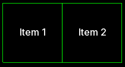

We can change it to column

```java
...
flexBox.getRoot()
    .setFlexDirection(YogaFlexDirection.COLUMN);
stage.addActor(flexBox);
```

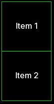

We can also list the elements in reverse.

```java
...
flexBox.getRoot()
    .setFlexDirection(YogaFlexDirection.COLUMN_REVERSE);
stage.addActor(flexBox);
```

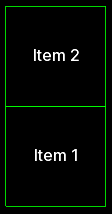

Let’s change another property. Instead of calling `FlexBox#getRoot()` again, we can just go down to a new line and chain together another setter. This sort of builder style makes the code a lot easier to read and reduces verbosity. This time let’s set the wrap. I want my rows to start from the top and wrap downwards, so I’ll select WRAP instead of WRAP_REVERSE.

```java
...
flexBox.getRoot()
    .setFlexDirection(YogaFlexDirection.ROW)
    .setWrap(YogaWrap.WRAP);
stage.addActor(flexBox);
```

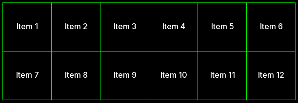

Now it’s ready for us to add widgets. We’re going to do some basic Labels with centered text in this example, but you can add any sort of Scene2D widget. Call flexbox.add and pass in the label. It’s that easy.

```java
...
Label label = new Label("Item 1", skin);
label.setAlignment(Align.center);
flexBox.add(label);
```

Presumably you’ll want to modify the properties of the node that you just created. `FlexBox#add()` actually returns a YogaNode that you can capture and modify. I prefer using the builder style. Again, it’s cleaner and it’s simpler. 

```java
...
flexBox.add(label)
    .setWidth(100)
    .setHeight(100);
```

If the width and height are going to be the same, you can simplify this further with the setSize method.

```java
...
flexBox.add(label)
    .setSize(100);
```

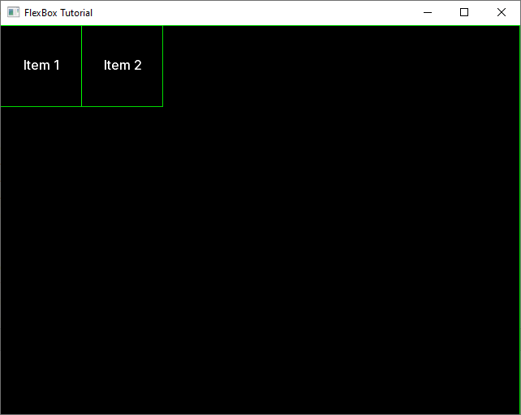

This might look better with some backgrounds. You can set the background of the root node like this.

```java
flexBox.getRoot()
    .setBackground(skin.getDrawable("some-drawable"));
```

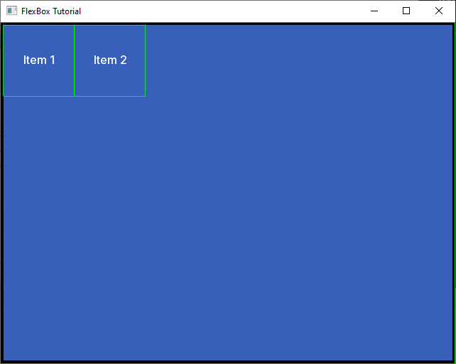

Note that the padding specified in the drawable you select changes the padding of the node. You can also set the backgrounds of your children nodes too.

```java
flexBox.add(label)
    .setSize(100)
    .setBackground(skin.getDrawable("some-other-drawable"));
```

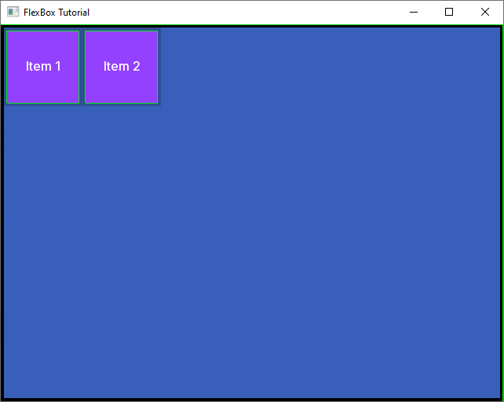

[See Source Code](lwjgl3/src/main/java/com/ray3k/flexbox/lwjgl3/FlexBoxTutorial.java)

This is a vast improvement over Table layout because you can’t do this without adding a bunch of Containers to your layout.

See more examples in the [FlexBox tests directory](https://github.com/lyze237/gdx-FlexBox/tree/main/src/test/java/dev/lyze/flexbox).

You actually shouldn’t use FlexBox for everything. Use it where it makes sense. Even the web devs will tell you that. Sometimes you want to use a table and use FlexBox inside a single cell. Think of it as a more powerful Horizontal or Vertical group.

## Challenges

Now it’s time for CHALLENGE MODE!

Here, I’m going to give you a sample image of a user interface and it’s your job to use FlexBox to match it’s layout. Use the provided [skin.json](resources/skin.zip). 

### Comic Book Panels

This is a comic book style of layout. Perhaps you can use this technique for some dynamic story telling.

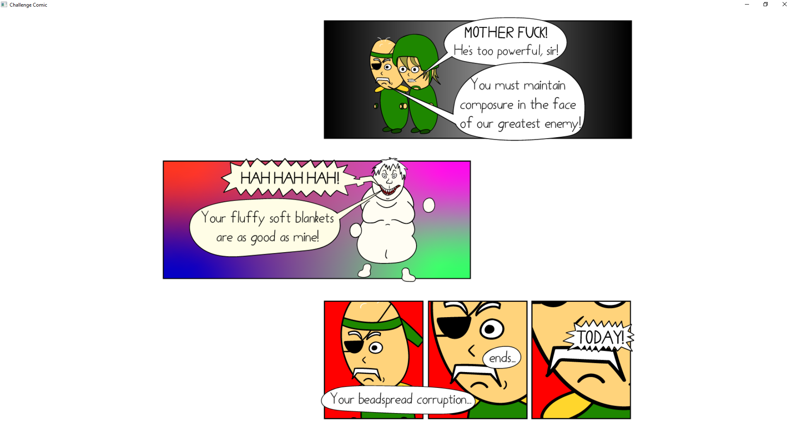

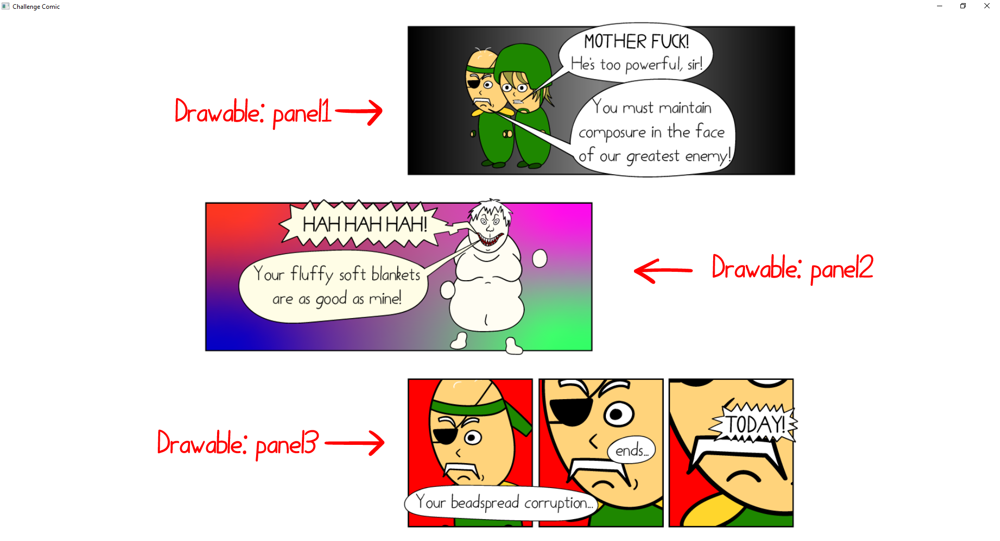

[See Source Code](lwjgl3/src/main/java/com/ray3k/flexbox/lwjgl3/ChallengeComic.java)

### Game Menu

This is a sort of menu for a game.

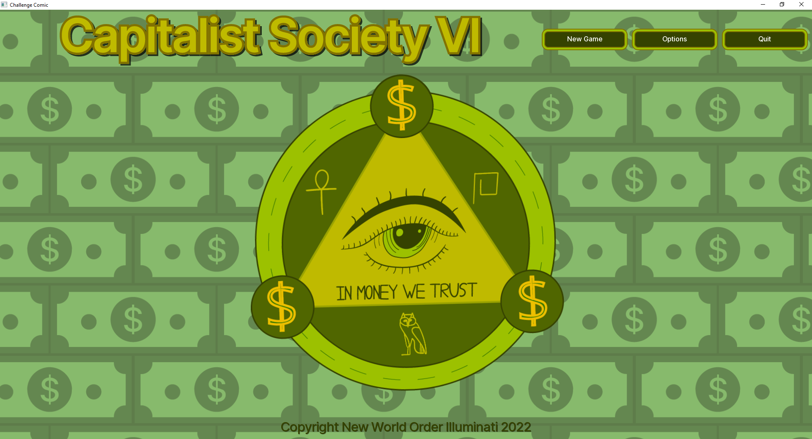

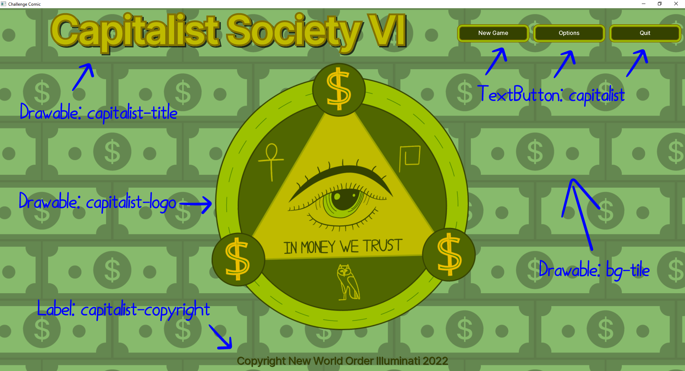

[See Source Code](lwjgl3/src/main/java/com/ray3k/flexbox/lwjgl3/ChallengeGameMenu.java)

### In-App Purchases

Now this is a good, better, best kind of menu. Maybe you can implement your bullshit in-app purchases this way.

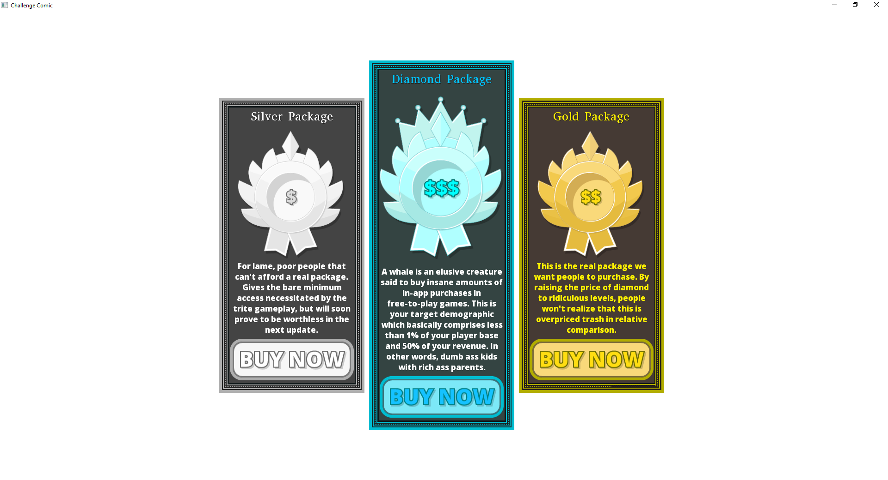

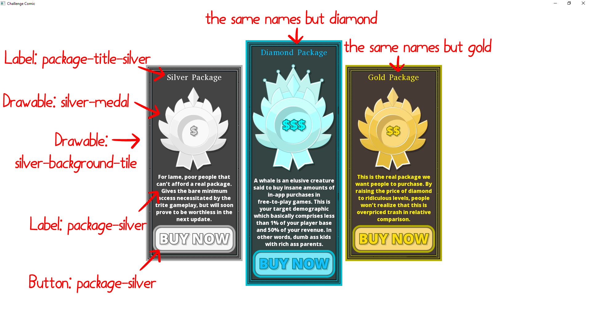

[See Source Code](lwjgl3/src/main/java/com/ray3k/flexbox/lwjgl3/ChallengeInAppPurchases.java)

## Conclusion

Well, that’s it. FlexBox is going to revolutionize how you do UI! And by revolutionize, I mean marginally make it better. But every little bit counts, right? Anyway, keep the skies clear amigos.